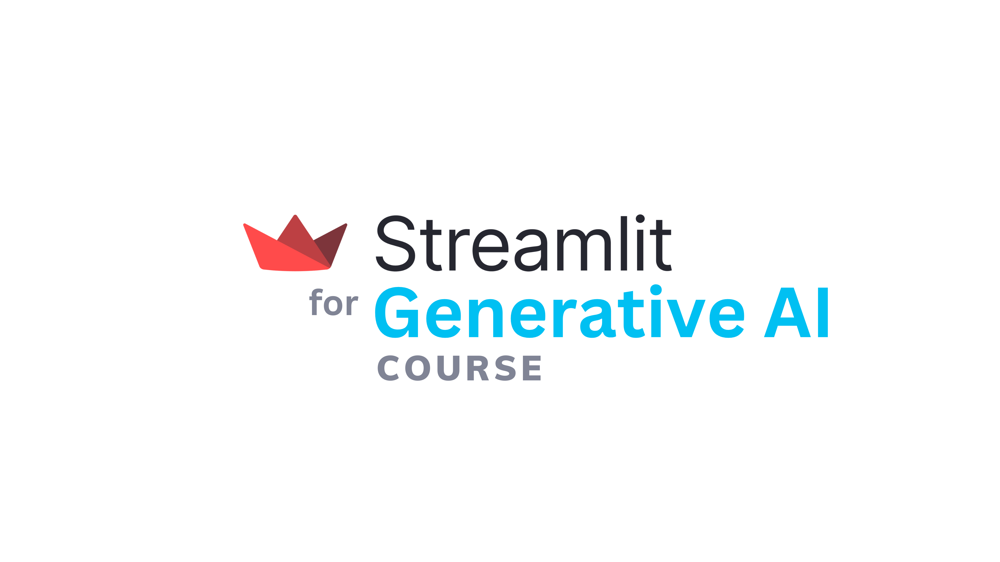

<p align="center">
  
</p>

## About
> The *Streamlit for Generative AI* course will show you how to use Streamlit to build large language model (LLM) powered apps. Finally you can deploy the Streamlit app to the cloud and share with the community.

## Table of contents
- [**Lesson 1** - Getting up to speed with Streamlit](./content/Lesson-1.md)
- [**Lesson 2** - Using LLM models from OpenAI](./content/Lesson-2.md)
- [**Lesson 3** - Using open source LLM models from Hugging Face Hub](./content/Lesson-3.md)
- [**Lesson 4** - Using hosted open source LLM models from Replicate](./content/Lesson-4.md)
- [**Lesson 5** - Orchestrating an LLM workflow with LangChain](./content/Lesson-5.md)
- [**Projects** - Build LLM-powered apps](./content/Projects.md)

## Resources
- [Build powerful generative AI apps](https://streamlit.io/generative-ai) - Streamlit resources on building LLM-powered apps.
- [Streamlit Gallery - LLM Category](https://streamlit.io/gallery?category=llms)
- [Streamlit Gallery](https://streamlit.io/gallery) - A collection of community apps for inspiring your own projects
- [Streamlit Quests](https://blog.streamlit.io/streamlit-quests-getting-started-with-streamlit/) - Start here to conveniently access all essential resources for learning and using Streamlit.
- [Streamlit Documentation](https://docs.streamlit.io/) - Your go-to place on using the Streamlit library.
- [Streamlit Cheat Sheet](https://docs.streamlit.io/library/cheatsheet) - All Streamlit commands on one-page.
- [#30DaysOfStreamlit](https://30days.streamlit.app/) - A Streamlit learning challenge.
- [Streamlit Forum](https://discuss.streamlit.io/) - Get unstuck and help others in using Streamlit.

## Python Libraries taught in this course

<table>
  <tr>
    <td><a href="https://streamlit.io/">Streamlit</a></td>
    <td><a href="https://openai.com/">OpenAI</a></td>
    <td><a href="https://huggingface.co/">Hugging Face</a></td>
    <td><a href="https://replicate.com/">Replicate</a></td>
    <td><a href="https://www.langchain.com/">LangChain</a></td>
  </tr>
</table>

## Citing us
Please use the following to cite this content:
```
@misc{st4genai,
    author = {Chanin Nantasenamat},
    title = {Streamlit for Generative AI Course},
    howpublished = {Streamlit Open Source},
    url = {\url{https://streamlit.io/}},
    year = {2023}
}
```

## Spread the word
Like the course? Help us spread the word!
- [Twitter](https://twitter.com/streamlit)
- [LinkedIn](https://www.linkedin.com/company/streamlit/)
