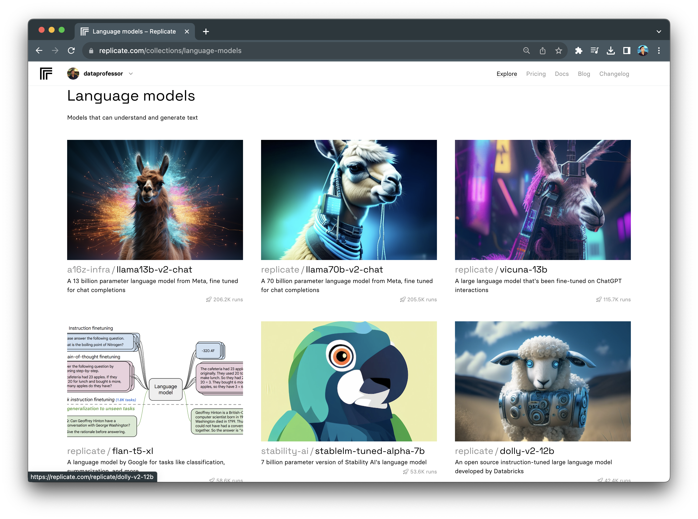
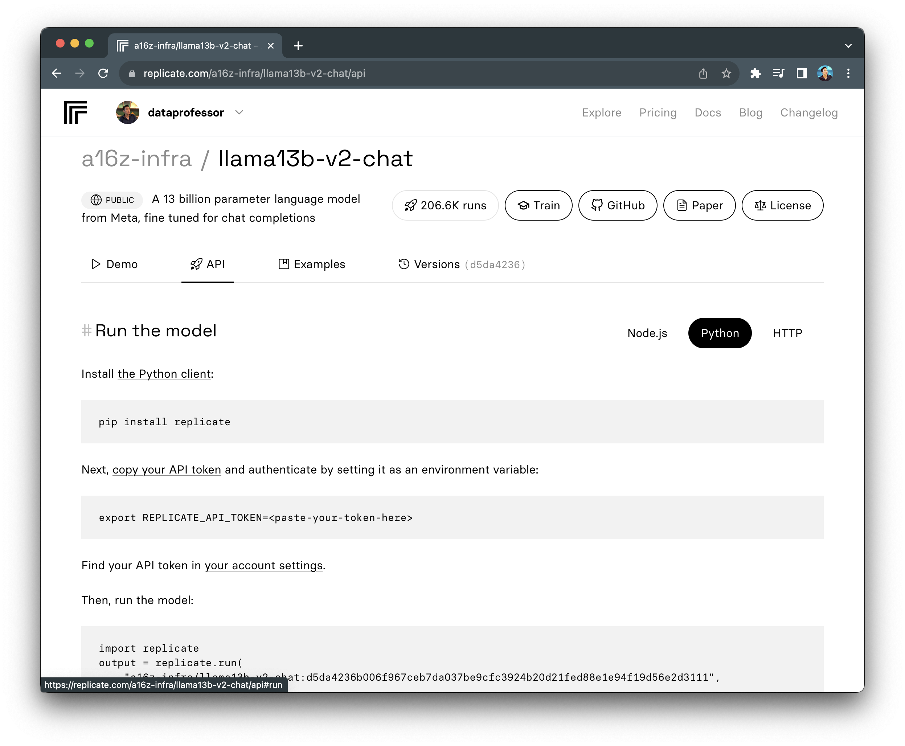
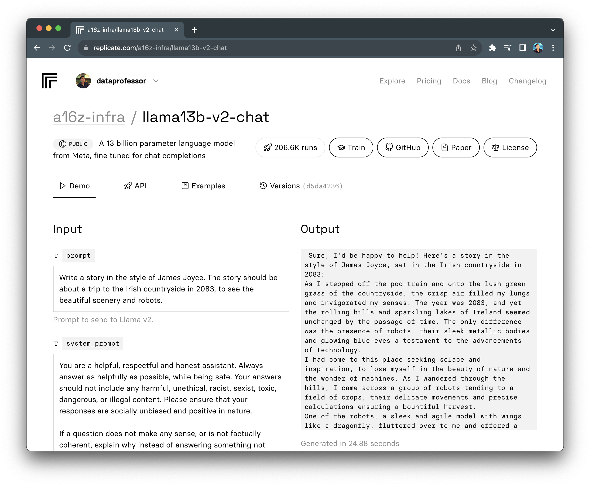

# 📓 Lesson 4 - Using hosted open source LLM models from Replicate

In this lesson, 

## Table of Contents
1. [What is Replicate?](#1-what-is-replicate)
2. [Installing Replicate](#2-installing-replicate)
3. [Setting the Replicate API token](#3-setting-the-replicate-api-token)
4. [Run an LLM model](#4-run-an-llm-model)
5. [Summary](#5-summary)

## 1. What is Replicate?

Replicate is an online platform that lets user run machine learning models in a few lines of code without the need to understand how machine learning works. This is particularly helpful for integrating machine learning functionality in any websites with no overhead on the model training and maintenance aspects. 

<p align="center">
   
</p>

Such models are accessible via a simple API call and Replicate's model page provide code snippets (available in Node.js, Python and HTTP) to get users started in provisioning their own projects.

<p align="center">
   
</p>

In addition, to code snippets, another notable feature on the model page is the Demo that allows the user to play with the LLM model. Go ahead, try adjusting the prompt and model parameters and see how it works.

<p align="center">
   
</p>

## 2. Installing Replicate

Of the above mentioned methods of using Replicate, we're going to use it via a Python library. 

Let's install the `replicate` library via `pip` as follows:

```Python
pip install replicate
```

Now, we're good to go

## 3. Setting the Replicate API token


<p align="center">
   
</p>


```Python
import os

os.environ["REPLICATE_API_TOKEN"] = "r8_xxxxxxxxxxxxxxxxxxx"
```

## 4. Running an LLM model


## 5. Summary


