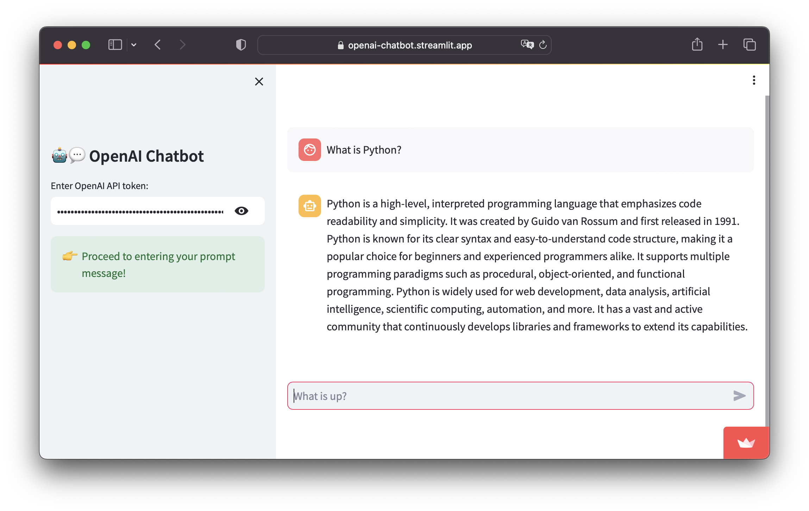

# 🕹️ Project 1 - Building a ChatGPT clone

## What are we building?

In this project, we're going to build a ChatGPT clone in Python using Streamlit for the frontend and the GPT 3.5 LLM model from OpenAI in the backend.

<p align="center">
   
</p>

## Try the app

[](https://openai-chatbot.streamlit.app/)

## Instructions on using the app

Here are instructions for using the app:
- **Step 1.** Go to the ChatGPT clone at https://openai-chatbot.streamlit.app/ or your own deployed instance
- **Step 2.** Enter your own OpenAI API key in the sidebar.
- **Step 3.** Enter a prompt message in the chat input box on the main panel (found at the bottom portion of the page) and hit on `Enter`.

That's it and in a few moments an LLM generated response should be returned as the displayed output.


## Installing prerequisite libraries

We'll be using 2 prerequisite libraries as follows:
```
streamlit
openai
```

So if you're building locally you can install these 2 libraries via `pip` as follows:

```
pip install streamlit openai
```

If deploying to Streamlit Community Cloud, you can go ahead and create a `requirements.txt` file containing the 2 lines mentioned above.

## Getting your own OpenAI API key

Please refer to the [_Getting your own OpenAI API key_](https://github.com/dataprofessor/streamlit-for-generative-ai/blob/master/content/Lesson-2.md#4-getting-your-own-openai-apikey) section of Lesson 2.

## Building the chatbot app

The code in its entirety is 37 lines of code, which can be saved into your app file (`streamlit_app.py`):

```Python
import openai
import streamlit as st

with st.sidebar:
    st.title('🤖💬 OpenAI Chatbot')
    if 'OPENAI_API_KEY' in st.secrets:
        st.success('API key already provided!', icon='✅')
        openai.api_key = st.secrets['OPENAI_API_KEY']
    else:
        openai.api_key = st.text_input('Enter OpenAI API token:', type='password')
        if not (openai.api_key.startswith('sk-') and len(openai.api_key)==51):
            st.warning('Please enter your credentials!', icon='⚠️')
        else:
            st.success('Proceed to entering your prompt message!', icon='👉')

if "messages" not in st.session_state:
    st.session_state.messages = []

for message in st.session_state.messages:
    with st.chat_message(message["role"]):
        st.markdown(message["content"])

if prompt := st.chat_input("What is up?"):
    st.session_state.messages.append({"role": "user", "content": prompt})
    with st.chat_message("user"):
        st.markdown(prompt)
    with st.chat_message("assistant"):
        message_placeholder = st.empty()
        full_response = ""
        for response in openai.ChatCompletion.create(
            model="gpt-3.5-turbo",
            messages=[{"role": m["role"], "content": m["content"]}
                      for m in st.session_state.messages], stream=True):
            full_response += response.choices[0].delta.get("content", "")
            message_placeholder.markdown(full_response + "▌")
        message_placeholder.markdown(full_response)
    st.session_state.messages.append({"role": "assistant", "content": full_response})
```


