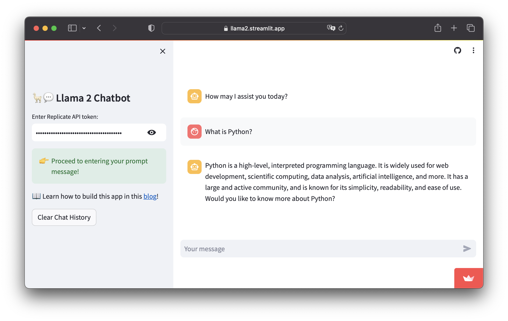

# 🕹️ Project 2 <br> Building a Llama 2 chatbot

## What are we building?

In this project, we're going to build a chatbot in Python using Streamlit for the frontend and the open source Llama 2 LLM model from Meta in the backend.

<p align="center">
   
</p>

## Try the app

[](https://llama2.streamlit.app/)

## Instructions on using the app

Here are instructions for using the app:
- **Step 1.** Go to the Llama 2 chatbot at https://llama2.streamlit.app/ or your own deployed instance
- **Step 2.** Enter your own Replicate API token in the sidebar.
- **Step 3.** Enter a prompt message in the chat input box on the main panel (found at the bottom portion of the page) and hit on `Enter`.

That's it and in a few moments an LLM generated response should be returned as the displayed output.


## Installing prerequisite libraries

We'll be using 2 prerequisite libraries as follows:
```
streamlit
replicate
```

So if you're building locally you can install these 2 libraries via `pip` as follows:

```
pip install streamlit replicate
```

If deploying to Streamlit Community Cloud, you can go ahead and create a `requirements.txt` file containing the 2 lines mentioned above.

## Getting your own OpenAI API key

Please refer to the [_Getting your own Replicate API token_](https://github.com/dataprofessor/streamlit-for-generative-ai/blob/master/content/Lesson-4.md#3-getting-your-own-replicate-api-token) section of Lesson 4.

## Building the chatbot app

The code in its entirety is 37 lines of code, which can be saved into your app file (`streamlit_app.py`):

```Python
import streamlit as st
import replicate
import os

# App title
st.set_page_config(page_title="🦙💬 Llama 2 Chatbot")

# Replicate Credentials
with st.sidebar:
    st.title('🦙💬 Llama 2 Chatbot')
    if 'REPLICATE_API_TOKEN' in st.secrets:
        st.success('API key already provided!', icon='✅')
        replicate_api = st.secrets['REPLICATE_API_TOKEN']
    else:
        replicate_api = st.text_input('Enter Replicate API token:', type='password')
        if not (replicate_api.startswith('r8_') and len(replicate_api)==40):
            st.warning('Please enter your credentials!', icon='⚠️')
        else:
            st.success('Proceed to entering your prompt message!', icon='👉')
    st.markdown('📖 Learn how to build this app in this [blog](https://blog.streamlit.io/how-to-build-a-llama-2-chatbot/)!')
os.environ['REPLICATE_API_TOKEN'] = replicate_api

# Store LLM generated responses
if "messages" not in st.session_state.keys():
    st.session_state.messages = [{"role": "assistant", "content": "How may I assist you today?"}]

# Display or clear chat messages
for message in st.session_state.messages:
    with st.chat_message(message["role"]):
        st.write(message["content"])

def clear_chat_history():
    st.session_state.messages = [{"role": "assistant", "content": "How may I assist you today?"}]
st.sidebar.button('Clear Chat History', on_click=clear_chat_history)

# Function for generating LLaMA2 response
# Refactored from https://github.com/a16z-infra/llama2-chatbot
def generate_llama2_response(prompt_input):
    string_dialogue = "You are a helpful assistant. You do not respond as 'User' or pretend to be 'User'. You only respond once as 'Assistant'."
    for dict_message in st.session_state.messages:
        if dict_message["role"] == "user":
            string_dialogue += "User: " + dict_message["content"] + "\n\n"
        else:
            string_dialogue += "Assistant: " + dict_message["content"] + "\n\n"
    output = replicate.run('a16z-infra/llama13b-v2-chat:df7690f1994d94e96ad9d568eac121aecf50684a0b0963b25a41cc40061269e5', 
                           input={"prompt": f"{string_dialogue} {prompt_input} Assistant: ",
                                  "temperature":0.1, "top_p":0.9, "max_length":512, "repetition_penalty":1})
    return output

# User-provided prompt
if prompt := st.chat_input(disabled=not replicate_api):
    st.session_state.messages.append({"role": "user", "content": prompt})
    with st.chat_message("user"):
        st.write(prompt)

# Generate a new response if last message is not from assistant
if st.session_state.messages[-1]["role"] != "assistant":
    with st.chat_message("assistant"):
        with st.spinner("Thinking..."):
            response = generate_llama2_response(prompt)
            placeholder = st.empty()
            full_response = ''
            for item in response:
                full_response += item
                placeholder.markdown(full_response)
            placeholder.markdown(full_response)
    message = {"role": "assistant", "content": full_response}
    st.session_state.messages.append(message)
```
