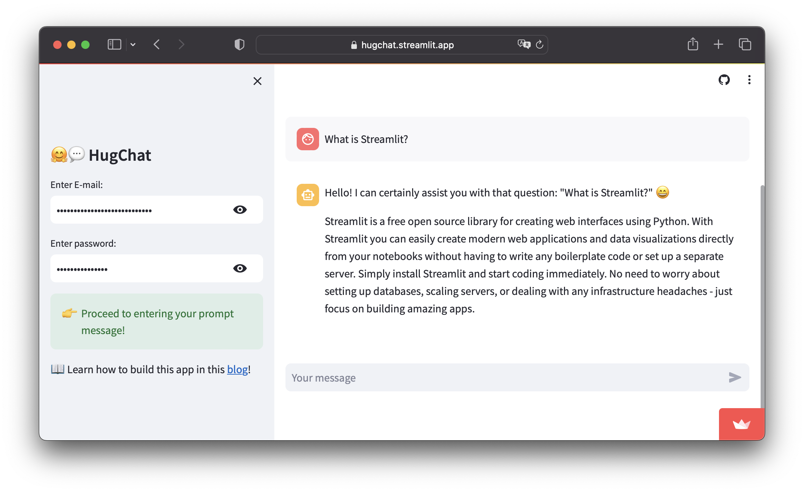

# 🕹️ Project 3 <br> Build a HuggingChat chatbot

## What are we building?

In this project, we're going to build a HuggingChat chatbot in Python using Streamlit for the frontend and the HuggingChat LLM model from Hugging Face in the backend.

<p align="center">
   
</p>

## Try the app

[](https://hugchat.streamlit.app/)

## Instructions on using the app

Here are instructions for using the app:
- **Step 1.** Go to the HugChat chatbot at https://hugchat.streamlit.app/ or your own deployed instance
- **Step 2.** Enter your own HuggingFace login credentials in the sidebar.
- **Step 3.** Enter a prompt message in the chat input box on the main panel (found at the bottom portion of the page) and hit on `Enter`.

That's it and in a few moments an LLM generated response should be returned as the displayed output.


## Installing prerequisite libraries

We'll be using 2 prerequisite libraries as follows:
```
streamlit
hugchat==0.0.8
```

So if you're building locally you can install these 2 libraries via `pip` as follows:

```
pip install streamlit hugchat==0.0.8
```

If deploying to Streamlit Community Cloud, you can go ahead and create a `requirements.txt` file containing the 2 lines mentioned above.

## Getting your own Hugging Face login credentials

Sign up for a Hugging Face account by going to https://huggingface.co/join

The login credentials that you'll use is the email address that will serve as your username along with your password.

## Building the chatbot app

The code in its entirety is 55 lines of code, which can be saved into your app file (`streamlit_app.py`):

```Python
import streamlit as st
from hugchat import hugchat
from hugchat.login import Login

# App title
st.set_page_config(page_title="🤗💬 HugChat")

# Hugging Face Credentials
with st.sidebar:
    st.title('🤗💬 HugChat')
    if ('EMAIL' in st.secrets) and ('PASS' in st.secrets):
        st.success('HuggingFace Login credentials already provided!', icon='✅')
        hf_email = st.secrets['EMAIL']
        hf_pass = st.secrets['PASS']
    else:
        hf_email = st.text_input('Enter E-mail:', type='password')
        hf_pass = st.text_input('Enter password:', type='password')
        if not (hf_email and hf_pass):
            st.warning('Please enter your credentials!', icon='⚠️')
        else:
            st.success('Proceed to entering your prompt message!', icon='👉')
    st.markdown('📖 Learn how to build this app in this [blog](https://blog.streamlit.io/how-to-build-an-llm-powered-chatbot-with-streamlit/)!')
    
# Store LLM generated responses
if "messages" not in st.session_state.keys():
    st.session_state.messages = [{"role": "assistant", "content": "How may I help you?"}]

# Display chat messages
for message in st.session_state.messages:
    with st.chat_message(message["role"]):
        st.write(message["content"])

# Function for generating LLM response
def generate_response(prompt_input, email, passwd):
    # Hugging Face Login
    sign = Login(email, passwd)
    cookies = sign.login()
    # Create ChatBot                        
    chatbot = hugchat.ChatBot(cookies=cookies.get_dict())
    return chatbot.chat(prompt_input)

# User-provided prompt
if prompt := st.chat_input(disabled=not (hf_email and hf_pass)):
    st.session_state.messages.append({"role": "user", "content": prompt})
    with st.chat_message("user"):
        st.write(prompt)

# Generate a new response if last message is not from assistant
if st.session_state.messages[-1]["role"] != "assistant":
    with st.chat_message("assistant"):
        with st.spinner("Thinking..."):
            response = generate_response(prompt, hf_email, hf_pass) 
            st.write(response) 
    message = {"role": "assistant", "content": response}
    st.session_state.messages.append(message)
```

